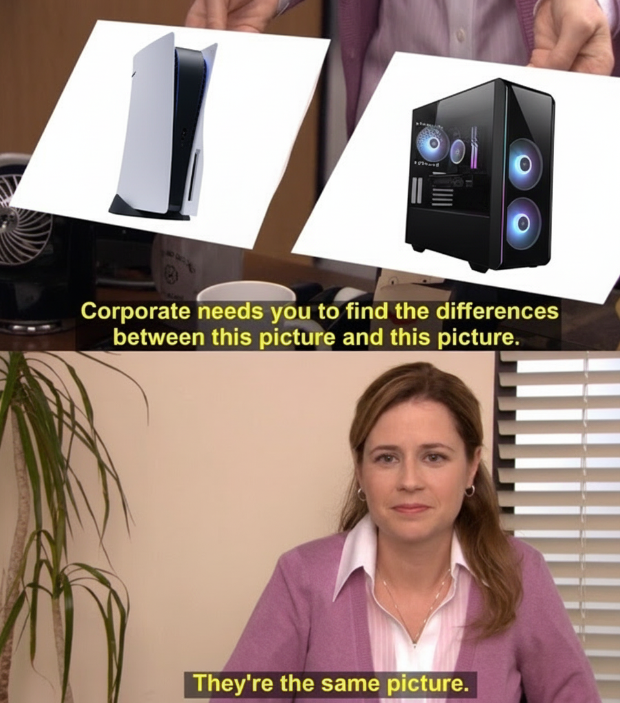
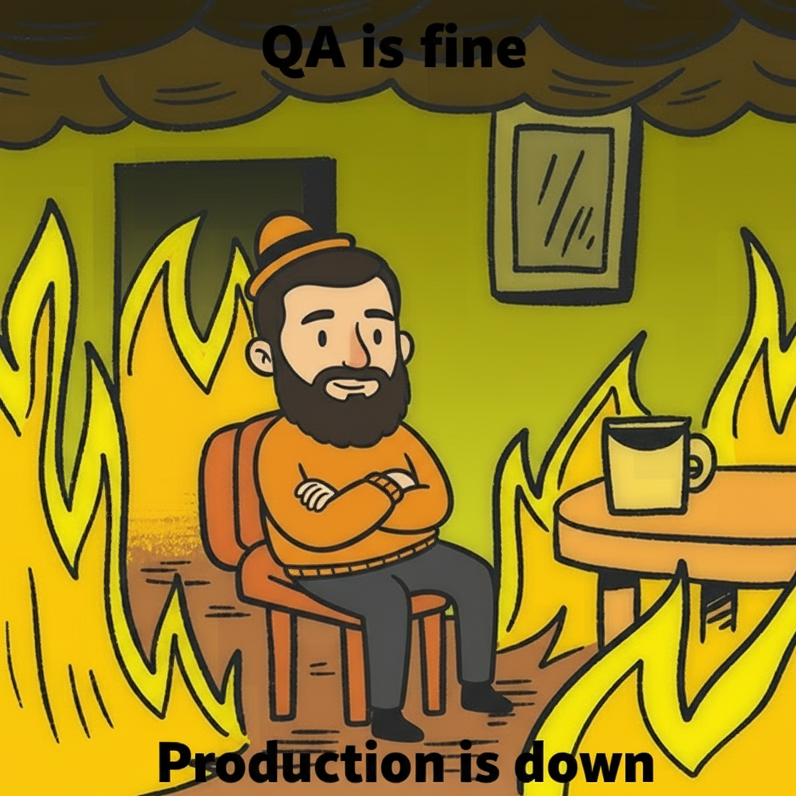

# I need a MEME

## Sophisticated state of the art meme generation AI

"I need a MEME" is a situational meme generation and lookup
application that combines the power of text AI and image generation to
create personalized memes. Users can describe situations or desired
memes, and the system intelligently matches them with appropriate
templates from the Memegen.link API, then generates custom content
using Gemini 2.5 Flash Image Preview.

## Live demo

[Live Demo](https://ineedameme.qqmber.wtf/)

## A few examples

When boss asked you to create an AI something


Sarcastic mocking meme about a playstation slowly becoming just a PC



Make a stonks meme but use a face from the reference, keep face details as realistic as possible as if it was copy-pasted there


Some sarcastic meme about QA



Jesus reacted with emoji :satan: in Slack chat


Ha gaaaaayyyyy! meme


## What it does

- Selects a suitable meme template from `meme_templates.json` (derived from Memegen.link)
- Downloads the template image
- Optionally takes a reference face (file or URL)
- Asks a text model to produce a concise edit instruction
- Asks an image model to generate the final meme
- Returns a `data:` URI you can render or download

Backend is FastAPI; the UI is a single static page served by the backend.

## Requirements

- Python 3.12+
- One of the following API setups:
  - Google API key (`GOOGLE_API_KEY`) — default provider
  - OpenRouter API key (`OPENROUTER_API_KEY`) with `MEMEGEN_PROVIDER=openrouter`

## Quickstart

```bash
python3.12 -m venv venv
source venv/bin/activate
pip install -r requirements.txt

export GOOGLE_API_KEY="<your_google_api_key>"
uvicorn src.api:app --reload
# Open http://localhost:8000/
```

Alternatively, you can run the built-in entrypoint:

```bash
export GOOGLE_API_KEY="<your_google_api_key>"
python -m src.api
```

Using Google instead of OpenRouter:

```bash
export MEMEGEN_PROVIDER=google
export GOOGLE_API_KEY="<your_google_api_key>"
uvicorn src.api:app --reload
# Open http://localhost:8000/
```

### Docker (local)

Build and run locally (maps 8000 -> container 8080):

```bash
docker build -t ai-memegen .
docker run --rm -p 8000:8080 \
  -e GOOGLE_API_KEY=YOUR_GOOGLE_KEY \
  ai-memegen
```

With OpenRouter provider:

```bash
docker run --rm -p 8000:8080 \
  -e MEMEGEN_PROVIDER=openrouter \
  -e OPENROUTER_API_KEY=YOUR_KEY \
  ai-memegen
```

## Deploy to Cloud Run (container)

Requirements:

- `gcloud` CLI configured and logged in
- A GCP project with Cloud Run and Cloud Build APIs enabled
- Billing enabled on the project

Steps:

1. Build and deploy using the provided script:

   ```bash
   ./deploy-cloudrun.sh <gcp-project-id> <service-name> <region>
   # Example:
   ./deploy-cloudrun.sh my-proj ineedameme europe-west1
   ```

   This will:
   - Build the container using Cloud Build
   - Push to `gcr.io/<project-id>/<service-name>:latest`
   - Deploy a Cloud Run service named `<service-name>` on port 8080

2. Set the required environment variables (choose provider):

   ```bash
   # Google (default)
   gcloud run services update <service-name> \
     --region <region> \
     --set-env-vars GOOGLE_API_KEY=<your_google_api_key>

   # OR OpenRouter
   gcloud run services update <service-name> \
     --region <region> \
     --set-env-vars MEMEGEN_PROVIDER=openrouter,OPENROUTER_API_KEY=<your_openrouter_api_key>
   ```

3. Open the service URL printed by the deploy command. The UI is served from `/`.

Notes:

- Cloud Run sets `$PORT`; the container listens on it via `uvicorn`.
- Default resource settings in `deploy-cloudrun.sh` are `--memory 1Gi`, `--timeout 300`, `--max-instances 3`.
- If uploads are large, consider increasing `--timeout` and `--memory`.


## Configuration

- `GOOGLE_API_KEY` (required by default provider Google).
- `OPENROUTER_API_KEY` (required if `MEMEGEN_PROVIDER=openrouter`).
- `MEMEGEN_PROVIDER` (optional): `openrouter` to use OpenRouter instead of default Google.
- `PORT` (optional): Port for the built-in runner in `src/api.py` (defaults to `8000`).

## Endpoints

### GET `/`
Serves the static UI from `static/index.html`.

### POST `/meme`
Create a meme. Expects a multipart form:

- `description` (string, required)
- `reference_url` (string, optional)
- `reference_file` (file, optional; image)

Response (200):

```json
{
  "mime_type": "image/png",
  "data_uri": "data:image/png;base64,...",
  "template_id": "stonks",
  "template_name": "Stonks"
}
```

Possible errors:
- 400 if the model refuses for safety/policy reasons
- 400 if `description` is missing
- 500 on other failures

Curl examples:

```bash
# With only a description
curl -s -X POST \
  -F "description=When your Friday deploy actually works" \
  http://localhost:8000/meme | jq .

# With a face image file
curl -s -X POST \
  -F "description=Make a Stonks meme with this face" \
  -F "reference_file=@/path/to/face.png" \
  http://localhost:8000/meme | jq .

# With a face image URL
curl -s -X POST \
  -F "description=It finally compiles" \
  -F "reference_url=https://example.com/face.jpg" \
  http://localhost:8000/meme | jq .
```

### GET `/memes/background`
Returns a random list of template image URLs, used by the UI for the background grid.

Query params:
- `count` (int, default 60)

Response:

```json
{ "images": ["https://...", "https://..."] }
```

## Web UI

Open `http://localhost:8000/`. Enter a description, optionally upload a face or provide an image URL, then press Generate. The result appears inline and can be downloaded.

## How it works (architecture)

- `src/core.py`
  - `TemplateRepository` loads templates from `meme_templates.json`
  - `OpenRouterTemplateMatcher` ranks templates via OpenRouter (model: `google/gemini-2.5-flash-image-preview:free`)
  - `ImageDownloader` fetches the blank template image
  - `ImageEditPromptGenerator` asks a text model for a concise edit instruction
  - `MemeImageGenerator` asks an image model to produce one final image and returns it as bytes
- `src/api.py`
  - Defines FastAPI app and endpoints
  - Serves static UI from `static/`

Important: reference images and template images are sent to OpenRouter (embedded in the request as `data:` URIs). Do not upload sensitive content.

## Development

- Run the server in dev mode:

  ```bash
  uvicorn src.api:app --reload
  ```

- Logs use the `ai.memegen` logger; request flow includes correlation IDs.
- A small programmatic example exists in `test.py` (writes `generated_image.png`). Adjust the hardcoded example before using.

## Troubleshooting

- "OpenRouter API key not provided" — set `OPENROUTER_API_KEY` in your environment
- 400 with a refusal message — the model declined for safety/policy reasons; try changing the description
- 500 generating image — transient issues; retry, or check connectivity and logs

## Attribution

- Templates: Memegen.link (`meme_templates.json`)
- Models via OpenRouter or Google Generative Language API — default model `google/gemini-2.5-flash-image-preview:free`

## License

No license specified. Use at your own risk.
